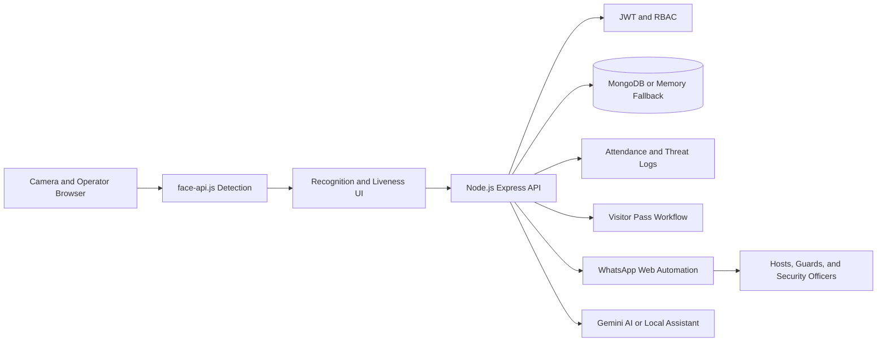

# NexusScan AI
## Intelligent Biometric Campus Security and Access Control

> A real-time security operations dashboard for identity-aware entry, attendance, visitor approvals, threat response, and remote security coordination.

---

## 1. Project Overview

NexusScan AI is a browser-based campus gate security platform designed to bring several daily security operations into one workspace:

- Face-based identity recognition at the gate
- Attendance and manual entry management
- Visitor approval and one-time digital gate passes
- Emergency threat reporting
- WhatsApp-based security notifications and commands
- Role-based access for administrators, guards, and faculty
- Live operational statistics and an AI security assistant

The system is intended for universities, schools, offices, and other controlled-access environments where security teams need fast decisions, clear records, and immediate communication.

---

## 2. The Problem

Traditional gate security often depends on disconnected processes:

- Attendance is recorded manually or in separate files.
- Visitor approvals require phone calls and repeated follow-ups.
- Unknown or suspicious individuals may not be escalated quickly.
- Security teams lack a shared live view of attendance and threats.
- Different staff members may have more access than their roles require.
- Reports take time to compile after an incident.

NexusScan AI addresses these issues by combining camera-assisted identification, operational workflows, access control, notifications, and reporting in one dashboard.

---

## 3. Core Value Proposition

**NexusScan AI helps security staff identify, decide, record, and notify from one place.**

The platform improves:

- **Speed:** Faster entry decisions and visitor approvals
- **Visibility:** Live camera, attendance, threat, and system status views
- **Accountability:** Time-stamped attendance, visitor, and threat records
- **Coordination:** WhatsApp notifications for hosts, guards, and security officers
- **Control:** Role-based permissions and emergency lockdown commands
- **Usability:** Dedicated desktop and mobile guard experiences

---

## 4. Feature Inventory

### 4.1 AI Face Recognition

- Uses `face-api.js` models for face detection, facial landmarks, and face descriptors.
- Supports local model loading from the `models/` directory with a CDN fallback.
- Compares detected faces with registered label profiles.
- Displays recognition results and confidence information in the scanner interface.
- Supports administrator-led face enrollment with multiple camera captures.
- Shows model loading and capture progress to the operator.
- Supports a manual-entry fallback when camera or AI models are unavailable.

### 4.2 Liveness and Anti-Spoofing Experience

- Uses facial landmark and eye-blink signals as part of the liveness workflow.
- Helps distinguish a live subject from a static image or replay attempt.
- Flags unknown or suspicious detections as security threats.
- Displays a visible threat banner on the security scanner.
- Sends threat notifications with an optional camera snapshot.

> Current implementation note: face detection and matching are performed in the browser using `face-api.js`. The server remains responsible for authenticated business workflows, records, alerts, visitor passes, and security commands.

### 4.3 Attendance Management

- Automatically records recognized entries through the dashboard workflow.
- Tracks `Present`, `Late`, `Leave`, and denied-entry states.
- Prevents repeated attendance notifications for the same person during the day.
- Supports manual attendance entry for operational exceptions.
- Supports leave marking.
- Displays present, late, and threat counts in live statistics.
- Restores attendance logs from the server when available.
- Exports attendance records as an Excel workbook.

### 4.4 Smart Visitor Entry

- Captures visitor full name, CNIC, host phone number, and visit purpose.
- Sends an approval request to the host through WhatsApp.
- Lets the host reply with `1` to approve or `2` to reject.
- Generates a digital pass in the format `NX-XXXX` after approval.
- Sends the approved pass information to gate security.
- Validates pass status, issue date, and one-time usage.
- Denies invalid, expired, rejected, or already-used passes.

### 4.5 Threat Detection and Emergency Response

- Supports automatic unknown-subject threat handling.
- Provides a manual emergency red-alert action for authorized roles.
- Records the threat reason and whether a snapshot was attached.
- Sends an emergency alert to the configured security WhatsApp number.
- Displays the alert state on the main camera screen.
- Tracks the number of threats detected today.
- Supports emergency lockdown through an authorized WhatsApp command.

### 4.6 WhatsApp Security Automation

The WhatsApp engine connects the dashboard to existing security communication channels.

**Automated notifications:**

- Attendance updates
- Threat alerts
- Visitor approval requests
- Visitor approval or rejection results
- Approved gate pass notifications

**Authorized commands:**

| Command | Result |
|---|---|
| `STATUS` | Returns live security, threat, server, and database status |
| `LOCK` | Activates emergency lockdown and disables scanning |
| `UNLOCK` | Releases lockdown and resumes normal operations |
| `ANNOUNCE <message>` | Publishes a temporary system announcement |
| `1` | Approves the latest pending visitor request |
| `2` | Rejects the latest pending visitor request |

Admin command access is controlled through the configured WhatsApp whitelist. The application also keeps dashboard APIs available if WhatsApp is offline.

### 4.7 Role-Based Access Control

| Role | Main responsibilities |
|---|---|
| **Admin** | Full dashboard access, face enrollment, threat response, log clearing, and system controls |
| **Guard** | Live camera monitoring, visitor entry, pass verification, manual entry, and emergency response |
| **Faculty** | Attendance and visitor workflows, live status, AI assistant, and Excel reporting |

Authentication uses username/password login, bcrypt password verification, JWT sessions, and role checks on protected API routes.

### 4.8 AI Security Assistant

- Accepts natural-language security questions.
- Reports attendance totals, late arrivals, threats, recent entries, and system state.
- Explains visitor pass status and lockdown behavior.
- Uses Google Gemini when `GEMINI_API_KEY` is configured.
- Falls back to a local rule-based assistant when Gemini is unavailable.
- Provides concise answers suitable for a busy security operator.

### 4.9 Mobile Guard View

- Provides a dedicated guard-oriented screen for smaller displays.
- Mirrors the camera feed and essential security status.
- Highlights threats, attendance, and quick visitor actions.
- Gives guards a focused operating view without requiring the full administration layout.

### 4.10 Operations and UX

- Live system clock and AI engine status
- Live analytics chart
- Camera offline state with permission guidance
- Toast notifications instead of blocking browser alerts
- Confirmation dialogs for sensitive actions
- Password visibility toggle on the login screen
- Responsive dark neon security-console interface
- Local model loading with fallback behavior

---

## 5. End-to-End Demonstration Flow

This is the recommended presentation sequence.

### Step 1: Sign in

Open the dashboard and demonstrate the login screen. Sign in as an Admin, Guard, or Faculty user to show role-specific access.

### Step 2: Show system readiness

Point out the live clock, camera status, AI model status, and analytics counters.

### Step 3: Demonstrate identity recognition

Present a registered face to the camera. Show the recognized name and attendance update. Then demonstrate an unknown face and explain the threat workflow.

### Step 4: Demonstrate visitor approval

Submit a visitor request with the visitor identity, host phone, CNIC, and purpose. Show the WhatsApp approval flow and the generated `NX-XXXX` pass.

### Step 5: Verify the gate pass

Enter the pass code in the verification workflow. Show that a valid pass grants entry and that a second attempt is rejected because the pass is single-use.

### Step 6: Demonstrate emergency response

Trigger the emergency alert or send `LOCK` from an authorized WhatsApp number. Show the dashboard lockdown state, then send `UNLOCK` to restore operations.

### Step 7: Ask the AI assistant

Ask questions such as:

- “How many people are present today?”
- “Are there any threats?”
- “What is the current system status?”
- “How does visitor approval work?”

### Step 8: Export the report

Download the attendance log as an Excel file and explain how it supports administration and audit review.

---

## 6. System Architecture



### Main technology components

- **Frontend:** HTML, CSS, JavaScript, Tailwind utility classes, face-api.js, Lucide icons, Chart.js
- **Backend:** Node.js and Express
- **Authentication:** bcryptjs and JSON Web Tokens
- **Database:** MongoDB through Mongoose, with an in-memory fallback when MongoDB is unavailable
- **Messaging:** whatsapp-web.js and QR-based local authentication
- **Reporting:** SheetJS/XLSX export
- **AI:** Google Gemini with local fallback responses
- **Models:** Tiny Face Detector, SSD MobileNet, 68-point landmarks, and face recognition models

---

## 7. Security and Privacy Positioning

- Passwords are verified with bcrypt hashes.
- JWT tokens protect authenticated sessions and API requests.
- Role middleware limits sensitive operations by user role.
- Admin WhatsApp commands can be restricted with `ADMIN_WHITELIST`.
- Raw face images are not intended to be retained as the identity record; registered profiles use face descriptor data and label metadata.
- Enrollment includes an explicit consent step in the user interface.
- Threat events can be logged with an optional snapshot for incident review.
- Visitor passes are time-limited and single-use.
- Authentication and dashboard APIs remain available when WhatsApp is disconnected.

### Important operational safeguards

- Change all default passwords before deployment.
- Set a strong `JWT_SECRET`.
- Configure `ADMIN_WHITELIST` so WhatsApp commands are not open in demo mode.
- Use HTTPS and restrict CORS in production.
- Protect the MongoDB instance and backup operational records.
- Obtain organizational consent before collecting biometric data.

---

## 8. Current API Surface

| Method | Endpoint | Purpose |
|---|---|---|
| `POST` | `/api/auth` | Authenticate a user and issue a JWT |
| `GET` | `/api/auth/me` | Validate the current session |
| `POST` | `/api/visitor-request` | Create a WhatsApp visitor approval request |
| `POST` | `/api/verify-pass` | Validate a digital gate pass |
| `POST` | `/api/attendance` | Save attendance or manual entry data |
| `POST` | `/api/threat-alert` | Record and dispatch a threat alert |
| `GET` | `/api/logs` | Return attendance, threat, and lock statistics |
| `GET` | `/api/labels` | Return available registered face labels |
| `GET` | `/api/system-status` | Return lockdown and announcement state |
| `GET` | `/api/export/excel` | Download an Excel attendance report |
| `POST` | `/api/ask-ai` | Ask the AI security assistant a question |

All protected endpoints require a Bearer JWT token and are further restricted by role where appropriate.

---

## 9. Configuration Requirements

| Variable | Purpose |
|---|---|
| `PORT` | Express server port, default `3000` |
| `JWT_SECRET` | Secret used to sign sessions |
| `ADMIN_PASSWORD` | Admin account password |
| `GUARD_PASSWORD` | Guard account password |
| `FACULTY_PASSWORD` | Faculty account password |
| `SECURITY_PHONE` | Main security notification number |
| `GUARD_PHONE` | Guard notification number |
| `ADMIN_WHITELIST` | WhatsApp numbers allowed to issue admin commands |
| `MONGO_URI` | MongoDB connection string |
| `GEMINI_API_KEY` | Optional Google Gemini integration key |
| `CHROME_PATH` | Optional Chromium executable path for WhatsApp automation |

### Local startup

```bash
npm install
node server.js
```

Then open the frontend through the local server at `http://127.0.0.1:3000`.

---

## 10. Current Limitations

- Face recognition currently depends on browser camera permissions and local client-side model inference.
- Without MongoDB, operational records use a memory fallback and can be lost when the server restarts.
- WhatsApp automation depends on a locally authenticated WhatsApp Web session and Chromium.
- Recognition quality depends on camera quality, lighting, pose, and enrollment quality.
- The current user directory is configuration-based rather than a full administrative user-management module.
- The current deployment is designed for a single local security node rather than a multi-site production environment.

These limitations should be presented as known engineering boundaries, not hidden from reviewers.

---

## 11. Future Roadmap

### Near-term improvements

- Move biometric storage and matching fully behind a protected server API.
- Remove remaining browser-local attendance state in favor of server-authoritative records.
- Add persistent biometric profile management and user administration.
- Add automated tests for authentication, pass expiry, one-time use, and role permissions.
- Add stronger audit trails for administrative actions.

### Production-scale improvements

- Use the official Meta WhatsApp Cloud API.
- Deploy with HTTPS, secrets management, and containerized services.
- Add multi-tenant PostgreSQL or MongoDB architecture.
- Support multiple RTSP/ONVIF IP cameras.
- Add centralized monitoring, backups, and incident retention policies.
- Add configurable privacy, retention, and consent controls for each organization.

---

## 12. Presentation Closing Statement

**NexusScan AI transforms a campus gate from a manual checkpoint into an intelligent security operation.** It connects biometric awareness, attendance, visitor authorization, emergency response, WhatsApp coordination, and AI-assisted reporting in one responsive platform, while keeping role permissions and operational limitations visible.
